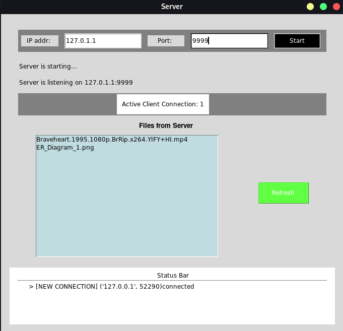
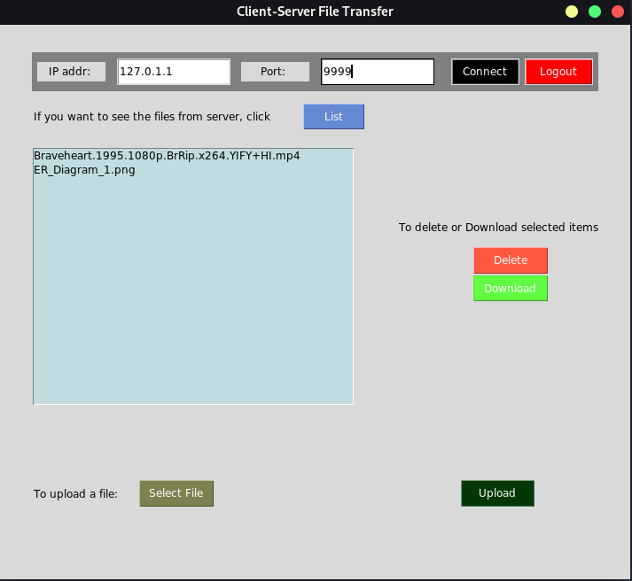
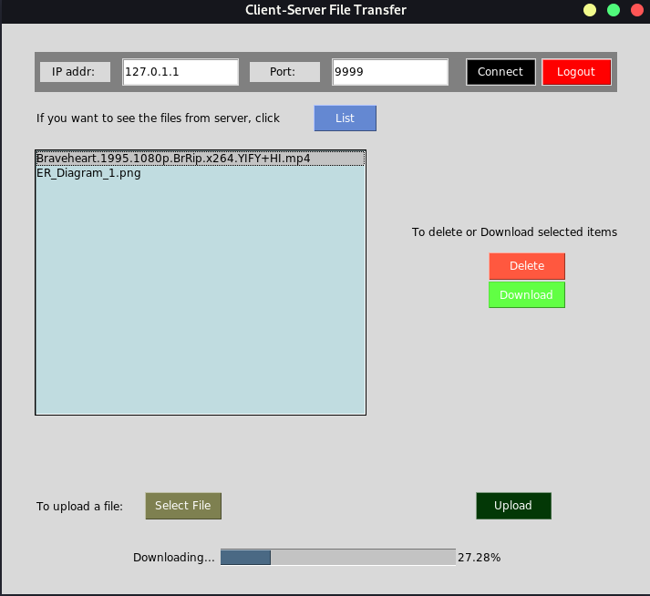

# FileHub - A simple file sharing system

## Introduction

This is a simple file sharing system that enables clients to connect to a file server  concurrently and share files among clients and server. This system is built with python for TCP network connection and tkinter for GUI.

## Server Manual

### Starting The Server

- run server.py file from terminal

  (linux -> python3 server.py) 

    OR

    download the server application from the repository release and open.

- After the server is open, start it by putting a valid ip address and unused port and click start.

    

### Server Functionalities

- Status Bar shows the ip address and port of the connected clients
- Refresh Button refreshes the file list.

## Client Manual

### Starting The Client

- after starting the server run client.py file from terminal

  (linux -> python3 client.py) 

    OR

    download the client application from the repository release and open.

- After the client is open, start it by putting the server ip address and port and click connect.

- To stop the server close the application

    

### Client Functionalities

- List Button updates the server file list.
- To delete a file select the target file of the server and click in delete button
- To download a file from the server, select the target file of the server and click in download button and file will start downloading in the client_data folder created by the client application showing a progress bar with percentage.

  

- To upload a file in the server, click in the upload button, a file dialogue will open, select the target file from your computer. File size will be shown in the GUI, if its okay, then click in the upload button and the file will start uploading in the server showing a progress bar with percentage.

- To disconnect from the server click in logout button.